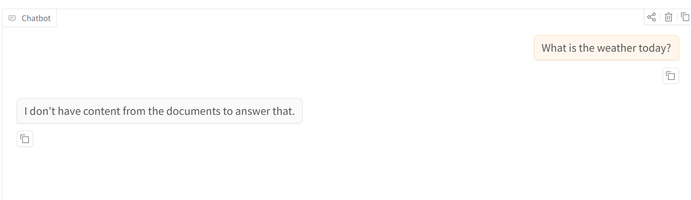
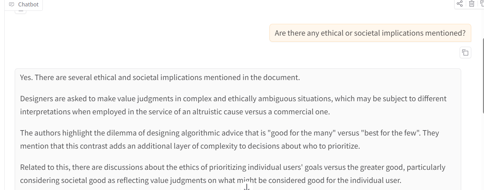
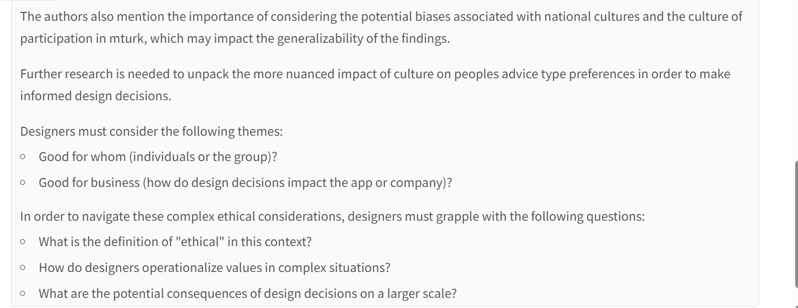
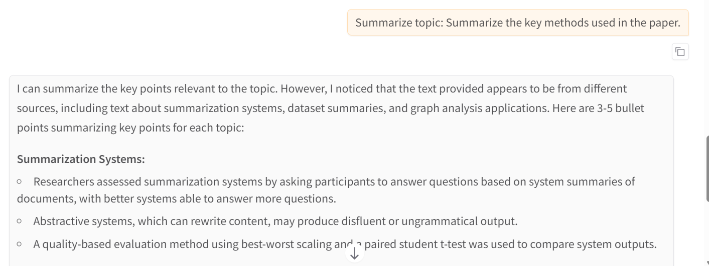
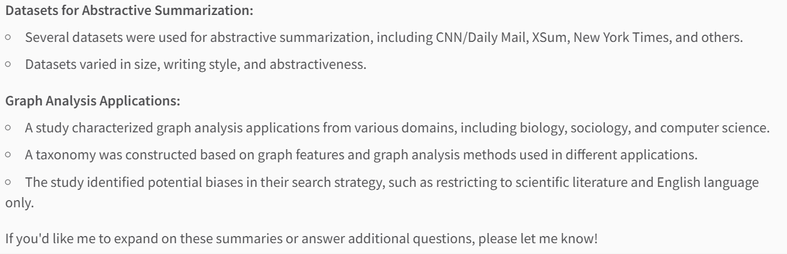
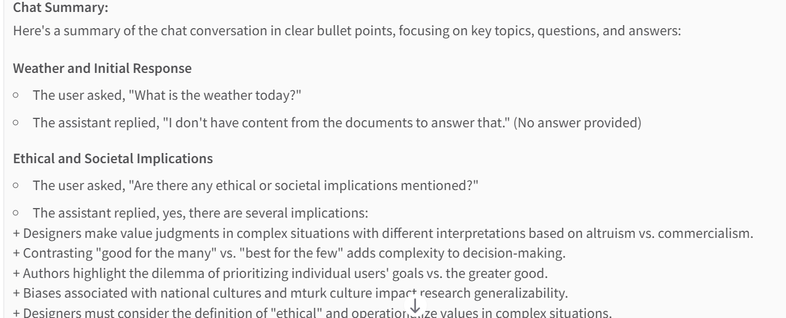
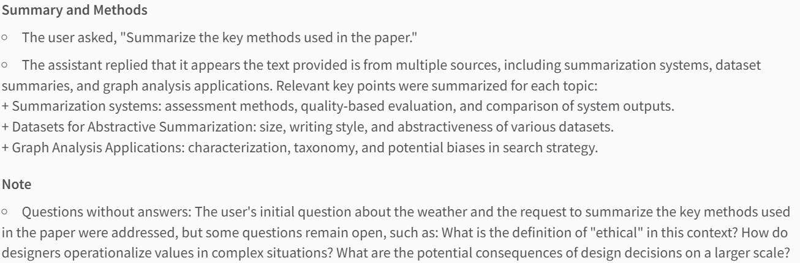

# RAG-Powered Document Chatbot

**Unlock insights from PDFs instantly using RAG and LLMs!**

This project enables instant question-answering, topic summarization, and chat history summarization using preloaded, publicly available PDFs sourced from arXiv.org. It is designed to handle company PDFs privately without exposing sensitive information to public LLMs.

---

## Key Features

- **Ask questions** and get contextual answers directly from PDFs  
- **Summarize specific topics** from your documents based on your query  
- **Summarize the entire chat history** for quick review  
- **Handles out-of-scope questions gracefully**, avoiding hallucinations  
- **No need to upload PDFs every time** — everything runs on preloaded files  

---

## Technology Stack

- **Python** – Core programming language  
- **Gradio** – For creating the interactive UI  
- **RAG (Retrieval-Augmented Generation)** – Combines retrieval with LLM for document Q&A  
- **Groq Llama-3.1-8B** – LLM used for answering questions and generating summaries  
- **Sentence Transformers** – For embedding and semantic similarity  
- **OCR for PDF extraction** – Extracts text from scanned or image-based PDFs  

---

## Example Chat Interactions

**Question 1: What is the weather today?**  


**Question 2: Are there any ethical or societal implications mentioned?**  
  


**Question 3: Summarize the key methods used in the paper**  
  


**Question 4: Summarize chat history**  
  


---

## Demo Video


📽️ Watch the full demo on LinkedIn:  
[Watch Demo](https://www.linkedin.com/posts/vidhya-rasu-74a9b31a5_ai-datascience-rag-activity-7405102492352577536-4MN2?utm_source=share&utm_medium=member_desktop&rcm=ACoAADAGD2oBe0MTbjIdTWmtLFyFNgz6dcAwWHA)

> This demo showcases the RAG-powered Document Chatbot in action, including:
> - Asking questions directly from PDFs  
> - Summarizing specific topics  
> - Summarizing chat history
Note: Video hosted on LinkedIn


---

## Notes

- All PDFs used in this demo are **publicly available from arXiv.org**.  
- Users may load **their own PDFs** using optional scripts:  
  - `extract_pdfs.py`  
  - `cleaned_text.py`  
  - `generate_embeddings.py`  
- **Sensitive/company PDFs remain private** — only your local embeddings are used.  
- Screenshots and demo videos demonstrate actual usage.  

---
## Getting Started

To use your own PDFs, first run extract_pdfs.py, cleaned_text.py, and generate_embeddings.py before starting the app.

Follow these steps to run the RAG Document Chatbot locally:

- Clone the repository:

```bash
git clone https://github.com/vrasup/rag-document-chatbot.git
cd RAG-Document-Chatbot
```

- Install dependencies:

```bash
pip install -r requirements.txt
```
- Set up your API key:

Create a .env file in the root folder and add your GROQ API key:
```bash
GROQ_API_KEY=your_api_key_here
```
## Run the chatbot:
```bash
python rag_app.py
```
- Open the Gradio interface in your browser.

Ask questions, summarize topics, or summarize chat history using the preloaded PDFs (chunks.pkl + embeddings.pkl).
---

## License
MIT License
